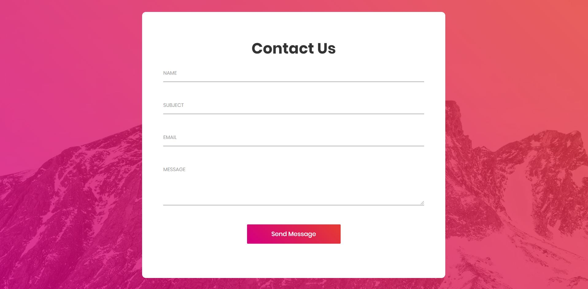

# Contact Us Page

Contact Us Page is a Basic Email Sending Contact Us Page created using `Django`, `HTML`, `CSS`, `Javascript`, `Jquery`, `Bootstrap`, `Fontawesome`.

---
## Steps to run Django app/server

 - Clone the project
```bash
  git clone https://github.com/jacktherock/Contact_Form-EmailConfiguration.git
```

 - Go to main project directory where `manage.py` locates
```bash
  cd ContactFmEmlCnfg
```

 - Run Django Server
 ```bash
  python manage.py runserver
```

Now Contact Us Page app server will run properly.

---
## Project images 
  - ## Contact page 
    - These is how the Contact Us page looks. 
        

---
## Thank You for Visiting !!
---